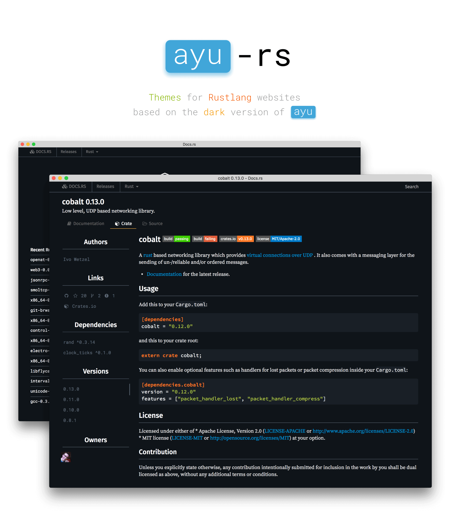

# ayu-rs

**Install using [Stylish](https://userstyles.org/styles/138541/ayu-rs-dark-theme)**

**
As seen on <a href="https://www.youtube.com/watch?v=7VulqInDO6Y">YouTube</a>
**

Home to CSS based on the ST3 theme [ayu](https://github.com/dempfi/ayu) for the purpose of beautifying various Rustlang websites. It currently supports the following:

* [docs.rs](https://docs.rs/)
* [www.rust-lang.org](https://www.rust-lang.org/)
* [doc.rust-lang.org](https://doc.rust-lang.org/)
  * **If you are reading the book version** that is rendered with [mdBook](https://github.com/azerupi/mdBook) **you must have the `Navy` theme selected** for this theme to apply
  * Rust 1.22.0 should natively include the Ayu theme for the book. Then you can view it in this colorscheme on any device :)
* [rustbyexample.com](https://rustbyexample.com/)
  * Note that this site natively provides the Ayu theme, except for the Ace editor; the CSS in this repo fixes that
* [crates.io](https://crates.io/)
* [play.rust-lang.org](https://play.rust-lang.org/)
  * Make sure you select the `Chrome` theme in the editor in order to use this theme's editor look
* [play.integer32.com](https://play.integer32.com/)
  * Same as above
* [this-week-in-rust.org](https://this-week-in-rust.org/)

## Usage

This theme is meant to be used with something such as [Stylish](https://addons.mozilla.org/en-US/firefox/addon/stylish/) (available for most browsers, not just Firefox). If you use Stylish, installation is as simple as going [here](https://userstyles.org/styles/138541/ayu-rs-dark-theme) and clicking the `Install Style` button. It will be automatically applied to the sites that it supports by default, but it can be used successfully with any hosted rust documentation. You can even integrate it with your own, freshly-built rustdocs [as shown here](https://blog.guillaume-gomez.fr/articles/2016-09-16+Generating+doc+with+rustdoc+and+a+custom+theme).

There are, of course, other extensions / plugins / add-ons that allow you to easily re-skin websites by injecting custom CSS, and if you are a user of one you can simply copy the CSS from this repo and apply it in whatever way your extension requires. If your extension of choice has a site for collecting themes (similar to [userstyles.org](https://userstyles.org)), feel free to open an issue asking to have this theme posted there.

## Issues

There will undoubtedly be issues with this custom CSS. When such problems arise, please open an issue on this repo with as much information as you can provide (ideally a screenshot of the offending item and some details as to where it can be found in the HTML / CSS). If it's a more subtle issue that requires some reproduction, steps for doing that would be much appreciated.

And as always, if you've fixed an issue or made an improvement yourself, feel free to open a PR! Less work for me and faster fixes for all.
